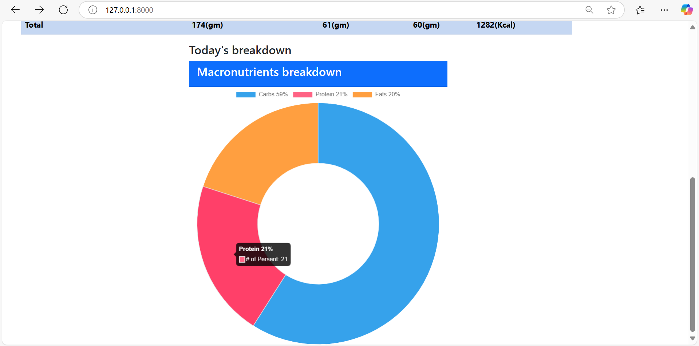

# Calorie Tracker

This project is a web-based Calorie Tracker application built with Python and Django. It allows users to set a calorie goal, track their daily food consumption, and view a breakdown of their macronutrient intake (carbohydrates, proteins, and fats).

---

## Features

- **Calorie Goal Management**: Users can set and monitor their daily calorie intake goals.
- **Food Consumption Tracking**: Add various food items to track their nutritional values including carbohydrates, proteins, fats, and calories.
- **Visualization**: Displays a dynamic pie chart that breaks down macronutrient percentages.
- **Admin Panel**: Manage food items and consumption records through Django's admin interface.

---

## Requirements

- Python 3.8+
- Django 4.0+
- SQLite (default database)
- Browser (Chrome, Firefox,Edge, etc.)

---

## Setup Instructions

### Clone the Repository
```bash
git clone https://github.com/CoderMahruf/Calorie-Count.git
cd mysite/
```

### Install Dependencies
```bash
pip install -r requirements.txt
```

### Apply Migrations
```bash
python manage.py makemigrations
python manage.py migrate
```

### Run the Development Server
```bash
python manage.py runserver
```

### Access the Application
- Open your browser and go to: `http://127.0.0.1:8000`
- Admin panel: `http://127.0.0.1:8000/admin`

---

## Usage

1. **Add Food Items**:
   - Select a food item from the dropdown and click "Add".
   - The food item is displayed in the table with its nutritional values.
2. **Remove Food Items**:
   - Click the red "X" button to remove a food item from the list.
3. **Visualize Nutritional Breakdown**:
   - View the pie chart below the table for a breakdown of macronutrient percentages.

---

## Screenshots

### Main Interface


### Macronutrient Breakdown


### Admin Panel


---


## API Endpoints

### Add Food Item
**URL**: `/add/`  
**Method**: POST

### Remove Food Item
**URL**: `/delete/<item_id>/`  
**Method**: POST

---

## Future Enhancements
- User authentication and personalized tracking.
- Integration with external nutrition databases for a wider variety of food items.
- Mobile responsiveness and dedicated mobile app.

---

## Contributors
- **Mahruful Alam**  
  Passionate about software and web development. Specializes in Python and Django.

---

## License
This project is licensed under the MIT License.

---

## Acknowledgments
- Django documentation.
- Chart.js for visualization.

